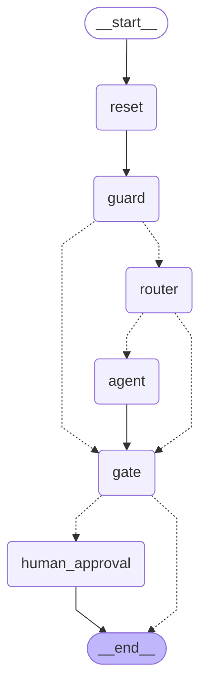

# PeopleOS orchestrator graph

Generated by `npm run graph` from the compiled LangGraph StateGraph.

```mermaid
%%{init: {'flowchart': {'curve': 'linear'}}}%%
graph TD;
	__start__([<p>__start__</p>]):::first
	reset(reset)
	guard(guard)
	router(router)
	agent(agent)
	gate(gate)
	human_approval(human_approval)
	__end__([<p>__end__</p>]):::last
	__start__ --> reset;
	agent --> gate;
	human_approval --> __end__;
	reset --> guard;
	guard -.-> gate;
	guard -.-> router;
	router -.-> agent;
	router -.-> gate;
	gate -.-> human_approval;
	gate -.-> __end__;
	classDef default fill:#f2f0ff,line-height:1.2;
	classDef first fill-opacity:0;
	classDef last fill:#bfb6fc;

```
